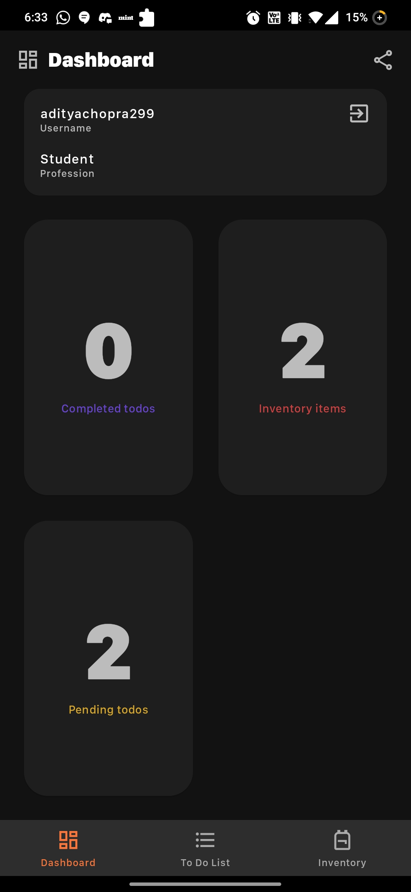
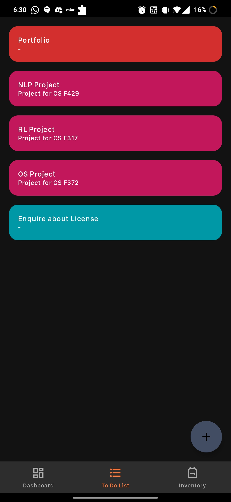
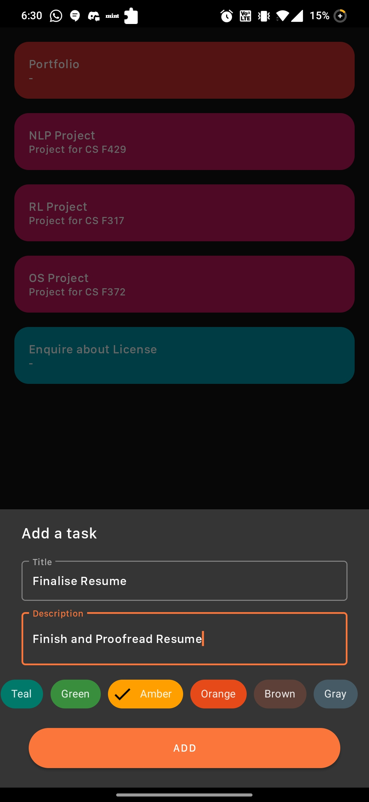
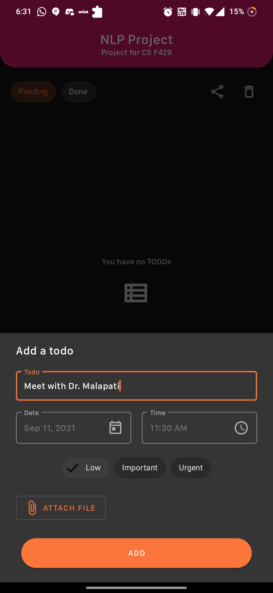
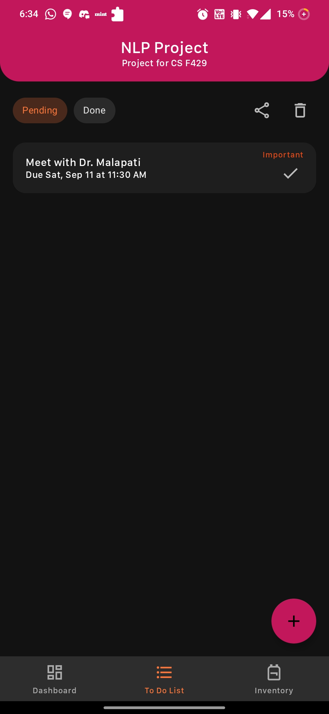
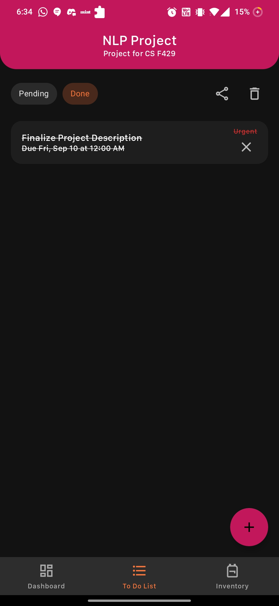
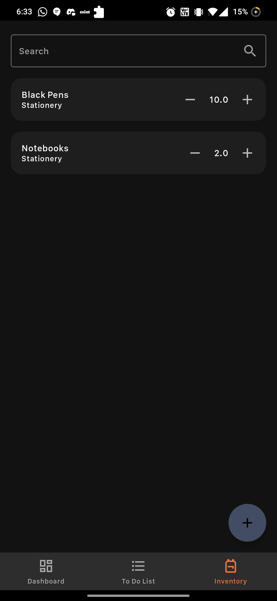

# Trackr (API)

Author: [Aditya Chopra (API)](https://github.com/adeecc) [Aryan Arora (App)](https://github.com/aryanarora180)

Built with [django](https://www.djangoproject.com/) and [django-rest-framework](https://www.django-rest-framework.org/)

## Brief Description

In modern households, due to hectic work schedules, it's quite difficult to remember, as well as manage, the availability of mandatory commodities in an urban home. Working professionals, homemakers, job-seekers, and others fail to keep track of their inventories and scheduled meetings which, in turn, either delay or terminate their regular duties. Sometimes, most people forget that they already have sufficient stock of certain items, and end up re-buying the same stuff again (toothpaste, soap, face wash, etc.) and, as a result, lose money and time. The inability of efficiently managing the home inventories will not only impact work schedules, but also cause stress, anger, and impatience. This automated app has been developed to keep track of these regular activities and aid people in managing the daily home inventories.

## Features
### Registration and sign in
- Create an account with your email address, username, phone number (with OTP verification), profession, and password.
- Or just sign in with Google.

### Todo list
- All todos are classified into tasks with todo items in their respective tasks.
- Each task has a title, description, and color.
- Each todo item has a todo, a deadline, an urgency, and an optional file attachment.
- Get email notifications 10 minutes before all todos with the file attachments (if any).
- All todos in a particular task can easily be shared on social media.

### Inventory
- Add items to keep track of your inventory.
- Each item has a name, category, quantity, and unit.
- In case of a long list of inventory items, you can easily search for items by their name or category.

### Dashboard
- View a few selected details about your profile.
- Get an “at a glance” view of the number of completed todos, pending todos, and inventory items.
- An option to share a screenshot of your dashboard with your friends on social media.

## Challenges faced
- Android development moves at a quick pace: using up-to date methods requires a lot of research. 
- Android storage permissions have become restricted on Android 10+ which made it difficult to upload and share files.
- Figuring out how to upload files using multipart form-data was difficult.

## Screenshots from App

